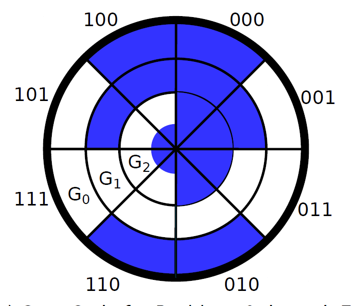

# 计算机逻辑设计基础

- 数学基础
  - 布尔代数
  - 逻辑代数基础
- 单元电路
  - 逻辑门电路、触发器
  - 性能分析和应用
- 组合逻辑电路的分析、设计与应用
- 时序逻辑电路的分析、设计与应用

## Chapter 1 Digital Systems and Information

### 数字系统

Discrete Information Processing System 离散信息处理系统

接受离散输入，产生离散输出。

System State 保存状态（内存）

#### Type of Digital Systems

- No state present 没有状态的系统
  
  组合逻辑系统 Combinational Logical System

  Output = F(Input)

- State system
  
  分类依据：状态更新时机

  - State update at discrete times
  
    Synchronous Sequential System 同步时序系统

  - State updated at any times

    Asyn Sequential System 异步时序系统

  状态更新 State = F(State, Input)

  输出 Output = F(State) or F(State, Input)

  Computer: Syn, 主频：更新状态频率

- Embedded System 嵌入式系统
  
  输入输出通常和物理世界直接相连，如收音、传感器。

  模拟信号->数字信号
  
  1. 周期采样（香农采样定理：采样频率高于信号最高频率的两倍以上）
  2. 量化：二进制序列量化（0-5V 内分为 16 份，用二进制表示）
  
  Signal Examples Over Time

  1. Analog 模拟信号: Continuous in value & time
  2. Digital 数字信号: Syn 同步、Asyn 异步

  Threshold Region 噪声容限：增加传输过程抗干扰能力

### Binary Arithmetic

- Addition
  Carries

- Subtraction
  Borrows

- Multiplication

- Convert
  除以 base 取整

### Binary Coding

二进制编码

- 非数值编码 Non-numeric
  不表示数值（表示颜色、符号等）

- 数值编码 Numeric
  - 8,4,-2,-1 Code 每一位有位权。
  - Excess 3 Code

  每个数字概率相同，1 出现的概率相同

  - BCD 码（8,4,2,1 Code）
    每一十进制数位用二进制表示
    优点：和人交互更直观

- BCD Arithmentic
  进位：8 + 4 = 13 > 9
  13 + 6 -> 1101 + 6 -> 10011 -> 10000 + 3

- ASCII Code
  7 位二进制
  '0'->0x30
  'A'->0x41
  'a'->0x61

### Parity Bit Error-Detection Codes

检测传输信息正确性 Error Detection.

原理：冗余信息 Redundancy

奇偶校检码，在末尾增加一个二进制位，保证整体 1 的个数奇偶性一致。接收端判断 1 的奇偶。(odd parity and even parity)

### Gray Code 格雷码

相邻两数之间一位不同。

旋转编码器

光传感器接收，避免出现中间结果，每次到达下一个状态只会变一位。

### UNICODE

16-bit (2-byte)